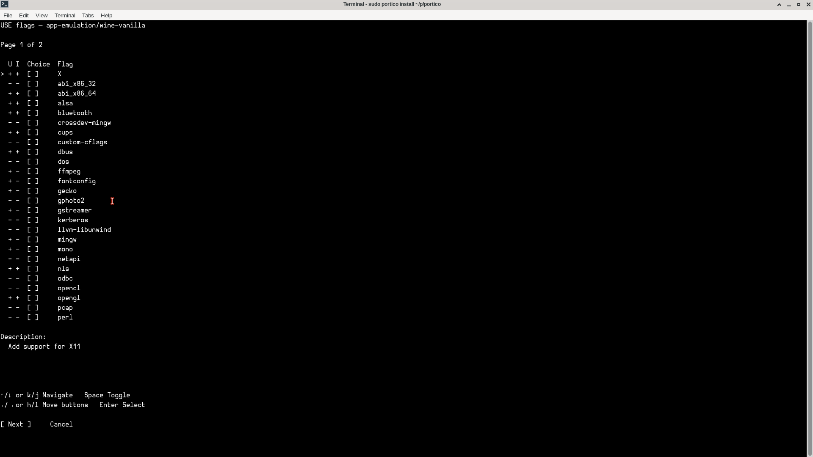
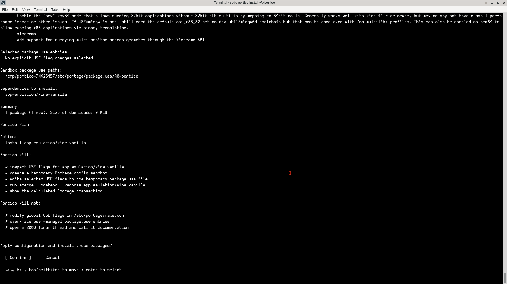

# Portico

A clearer CLI/TUI entrance to Gentoo Portage for choosing package features and safely running `emerge`.

Portico does not replace Portage. It wraps common package workflows with a reviewable plan, scoped config writes, and a friendlier USE flag flow.

It is meant to make common Portage tasks easier to understand without hiding what Gentoo is actually doing.

## Screenshots

<p align="center">
  
</p>

<p align="center">
  
</p>

## What Portico does

Portico helps with:

- searching for packages
- inspecting package USE flags
- installing one or more packages
- rebuilding one or more packages with revised USE flags
- updating packages
- uninstalling packages
- cleaning unused packages with depclean
- managing repositories / overlays
- choosing an install source when a package exists in more than one enabled repository

Portico favors package-specific configuration and explicit confirmation before making system changes.

Where possible, Portico first tests changes in a temporary Portage configuration sandbox, previews the resulting transaction, and only writes real configuration after confirmation.

## What Portico will not do

Portico will not:

- replace Portage
- replace the Gentoo Handbook
- hide Portage warnings
- silently modify global USE flags
- globally enable unstable keywords
- globally accept licenses
- overwrite user-managed Portage config without showing what it intends to do
- run package mutations without root privileges
- run depclean automatically after uninstalling unless you confirm it
- silently choose between multiple enabled repositories when Portico detects that a package is available from more than one source
- treat donated mirrors like a stress toy

Portico should make Gentoo package management easier to follow, not less transparent.

## Commands

Portico supports routed help for every command:

```sh
portico --help
portico --help find
portico --help query
portico --help install
portico --help rebuild
portico --help update
portico --help uninstall
portico --help clean
portico --help repo
portico --help repo sync
portico --help overlay remove
```

Standard Cobra-style help also works:

```sh
portico install --help
portico repo sync --help
```

Check the current Portico version:

```sh
portico --version
portico -v
```

Development builds report:

```text
unstable
```

Release and Portage builds can inject the actual version at build time.

## Search for packages

```sh
portico find <query>
```

Searches package names and descriptions.

Example:

```sh
portico find irssi
```

`find` is read-only and does not require root privileges.

Portico may improve how results are displayed or ranked, but package names, descriptions, versions, and repository information come from the Gentoo system.

## Inspect a package

```sh
portico query <atom>
```

Shows package USE flags and descriptions.

Example:

```sh
portico query net-irc/irssi
```

`query` is read-only and does not require root privileges.

USE flag names and descriptions are provided by Gentoo tooling and are displayed as system-provided package metadata.

## Install packages

```sh
sudo portico install <atom[@version][::repository]...>
```

Configures selected USE flags, previews the Portage transaction, and installs the requested package or packages.

Examples:

```sh
sudo portico install net-irc/irssi
sudo portico install net-irc/irssi app-misc/tmux
```

Portico supports package version shorthand:

```text
atom@version
```

Example:

```sh
sudo portico install app-editors/emacs@30.1
```

Portico translates that to a Portage-compatible version-pinned atom:

```text
=app-editors/emacs-30.1
```

Portico also supports explicit repository selection using Gentoo's native repository qualifier syntax:

```text
atom::repository
atom@version::repository
```

Examples:

```sh
sudo portico install mail-client/mailspring-bin::guru
sudo portico install mail-client/mailspring-bin@1.23.0::guru
```

These resolve to Portage-compatible install targets:

```text
mail-client/mailspring-bin::guru
=mail-client/mailspring-bin-1.23.0::guru
```

When a repository is specified explicitly, Portico skips the package source picker for that atom.

### Package source picker

If an unqualified requested atom is available from more than one enabled repository, Portico prompts you to choose the source before continuing.

Portico discovers source candidates using:

```sh
emerge -pvO <atom>
```

The source picker shows:

- repository / overlay name
- latest available version from that repository
- source status
- explicit install target

Example source picker shape:

```text
Select package source — mail-client/mailspring-bin

  Repository         Latest version    Status       Install target
> guru               1.23.0            masked       =mail-client/mailspring-bin-1.23.0::guru
  edgets             1.23.0            masked       =mail-client/mailspring-bin-1.23.0::edgets

Selected target: =mail-client/mailspring-bin-1.23.0::guru

↑/↓ or k/j Navigate   PgUp/PgDn Page   Enter Select   Esc/q Cancel
```

If only one repository provides the requested atom, Portico continues normally.

If multiple repositories provide the atom, Portico will not silently choose one.

Portico will:

- inspect USE flags for each requested package
- let you choose package-specific USE flag changes
- prompt for a package source when multiple enabled repositories provide an unqualified atom
- respect explicit `::repository` targets
- create a temporary Portage config sandbox
- run `emerge --pretend --verbose`
- resolve supported package-specific keyword, license, and dependency USE requirements
- show the calculated transaction
- ask before writing real config or running `emerge`
- run one combined `emerge` transaction

Portico will not:

- modify `/etc/portage/make.conf`
- globally enable testing keywords
- globally accept licenses
- silently pick between multiple enabled repositories when source selection is needed
- rely on `emerge --ask` for confirmation

Portico's own confirmation is the confirmation step.

## Rebuild packages

```sh
sudo portico rebuild <atom...>
```

Revises USE flags and rebuilds one or more packages with `emerge --oneshot`.

Example:

```sh
sudo portico rebuild net-irc/irssi
```

Use `rebuild` when a package is already installed but you want to rebuild it with different package-specific configuration.

Portico will:

- inspect current USE flags
- let you revise package-specific USE choices
- preview the rebuild transaction
- write scoped Portage config
- run `emerge --oneshot`

Portico will not:

- add rebuilt packages to `@world`
- uninstall packages first
- run `depclean`
- globally change USE flags

## Update packages

```sh
sudo portico update
```

Updates the world set.

```sh
sudo portico update <atom...>
```

Updates one or more specific packages.

Examples:

```sh
sudo portico update
sudo portico update net-irc/irssi
sudo portico update net-irc/irssi app-misc/tmux
```

With no package arguments, Portico updates `@world`.

With package arguments, Portico updates only the selected packages.

Portico previews the transaction before running the update.

Current limitation: update can handle some package-specific license requirements, but update-time USE autounmask changes are not fully supported yet.

## Uninstall packages

```sh
sudo portico uninstall <atom...>
```

Uninstalls one or more packages using `emerge --unmerge`.

Example:

```sh
sudo portico uninstall net-irc/irssi
```

Multiple packages can be uninstalled in one command:

```sh
sudo portico uninstall net-irc/irssi app-misc/tmux
```

Portico will:

- preview `emerge --unmerge <atom...>`
- ask before uninstalling the requested package or packages
- run `emerge --unmerge <atom...>` with a progress UI
- surface Portage's pre-removal countdown/waiting state
- allow cancellation before and during the removal workflow
- ask whether to start the clean workflow afterward

Portico will not:

- run depclean automatically
- remove packages that were not included in the unmerge unless you confirm the later clean workflow
- modify Portage config

Use this when you know the package or packages you want removed.

## Clean unused packages

```sh
sudo portico clean
```

Previews and runs:

```sh
emerge --depclean
```

Use this to let Portage remove packages that are no longer needed by the world set or installed packages.

Portico will:

- preview `emerge --depclean`
- ask before running the real depclean
- run `emerge --depclean` with a progress UI
- surface Portage's pre-removal countdown/waiting state
- allow cancellation before and during the cleanup workflow

`clean` does not take package arguments. It is a Portico-managed wrapper around Portage depclean behavior.

## Manage repositories

```sh
portico repo list
sudo portico repo add <name>
sudo portico repo remove <name>
sudo portico repo sync
sudo portico repo sync <name>
```

`overlay` is also available as an alias:

```sh
portico overlay list
sudo portico overlay add <name>
sudo portico overlay remove <name>
sudo portico overlay sync
sudo portico overlay sync <name>
```

Portico uses `repo` as the canonical command and `overlay` because Gentoo users say overlay.

Both command groups use the same repository-management behavior.

### Repository source of truth

Portico treats Gentoo's enabled repository state as authoritative.

Enabled repositories are read from:

```sh
eselect repository list -i
```

Portico does not treat directories under `/var/db/repos` as proof that a repository is enabled.

Portico does not treat files under `/var/cache/portico` as proof that a repository is enabled.

Those locations are supporting filesystem/cache state only.

### List repositories

```sh
portico repo list
portico overlay list
```

Lists repositories currently enabled through Gentoo repository tooling.

### Add a repository

```sh
sudo portico repo add <name>
sudo portico overlay add <name>
```

Example:

```sh
sudo portico repo add guru
```

Add behavior is idempotent:

- if the repository is not enabled, Portico enables it and syncs it
- if the repository is already enabled, Portico leaves it enabled and syncs it
- after enabling, Portico verifies that Gentoo reports the repository as enabled before syncing

Under the hood, Portico uses Gentoo tooling such as:

```text
eselect repository enable <name>
emaint sync -r <name>
```

### Sync repositories

Force-sync all enabled repositories:

```sh
sudo portico repo sync
sudo portico overlay sync
```

Force-sync one enabled repository:

```sh
sudo portico repo sync guru
sudo portico overlay sync guru
```

Explicit sync means:

```text
sync now
```

### Preflight sync

Preflight sync is the mirror-friendly mode.

It syncs only repositories that Portico has never synced or that are stale according to Portico's sync stamp metadata.

Preflight sync all enabled repositories:

```sh
sudo portico repo sync --preflight
sudo portico repo sync -p
sudo portico overlay sync --preflight
sudo portico overlay sync -p
```

Preflight sync one repository:

```sh
sudo portico repo sync guru --preflight
sudo portico repo sync guru -p
sudo portico overlay sync guru --preflight
sudo portico overlay sync guru -p
```

Preflight sync means:

```text
sync only if needed
```

By default, Portico treats repositories as stale after 24 hours.

Sync stamps are stored under:

```text
/var/cache/portico/repo-sync
```

Sync stamps are freshness metadata only. They do not define whether a repository exists or is enabled.

### Remove a repository

```sh
sudo portico repo remove <name>
sudo portico overlay remove <name>
```

Example:

```sh
sudo portico repo remove guru
```

Portico removal behavior:

- refuses to remove the protected `gentoo` repository
- checks installed package metadata under `/var/db/pkg`
- blocks removal if installed packages came from that repository
- allows forced removal with `--force`
- warns when forced removal affects installed packages
- verifies the repository no longer appears enabled after disabling
- removes Portico's own sync stamp after successful removal

Forced removal:

```sh
sudo portico repo remove guru --force
sudo portico overlay remove guru --force
```

Portico does not:

- delete repository files from `/var/db/repos`
- delete package configuration
- run `depclean`
- migrate installed packages
- reinstall packages from another repository

If installed packages came from a repository, rebuild or reinstall them from another repository before removing it.

## Safety model

Portico writes its own scoped config files under `/etc/portage`, such as:

```text
/etc/portage/package.use/90-portico
/etc/portage/package.accept_keywords/90-portico
/etc/portage/package.license/90-portico
```

When a package requires a keyword, Portico writes a package-specific keyword entry using the exact keyword token reported by Portage.

For example:

```text
media-video/obs-studio ~amd64
```

or on another architecture:

```text
dev-libs/example ~arm64
```

Portico does not write:

```text
ACCEPT_KEYWORDS="~amd64"
```

When Portage requires dependency USE changes, Portico writes scoped `package.use` entries for the affected packages.

Unsupported mask types stop the transaction instead of being guessed around.

The core safety rule is:

```text
If Portico needed a configuration change to make the sandbox transaction valid,
that same confirmed configuration must exist before the real transaction runs.
```

## Repository syncing

Portico avoids unnecessary repository syncing during normal package workflows.

Read-only commands such as `find` and `query` do not normally sync repositories. If Portico detects an enabled repository that has never been synced, it warns and asks whether to sync it.

Mutation commands such as `install`, `rebuild`, and `update` sync when needed.

Manual sync commands are explicit:

```sh
sudo portico repo sync
```

means sync all enabled repositories now.

```sh
sudo portico repo sync --preflight
```

means sync only enabled repositories that are stale or never synced by Portico.

## Requirements

Portico expects a Gentoo system with Portage available.

Required Gentoo tools:

- `emerge`
- `equery`
- `emaint`
- `eselect repository`

`equery` is provided by `app-portage/gentoolkit`:

```sh
sudo emerge app-portage/gentoolkit
```

Repository management requires Gentoo repository tooling to be configured on the system.

Portico is written in Go. It should compile anywhere Go supports, but Portico's runtime behavior depends on Gentoo and Portage being available.

## Contributions

Contributions are welcome.

Portico is still early, and help is especially useful in areas that make it clearer, safer, and more useful across different Gentoo systems.

Good contribution areas include:

- bug fixes
- i18n translations
- help text improvements
- clearer command examples
- Portage output parsing fixtures
- non-amd64 architecture testing
- USE flag picker usability
- repository / overlay edge cases
- documentation for real-world workflows
- unit tests

Bug fixes are especially welcome. Portico interacts with real system package management, so small correctness fixes matter a lot. If Portico parses Portage output incorrectly, writes config too broadly, misses an edge case, or explains a risky operation poorly, that is worth fixing.

i18n help is also especially welcome. Portico's user-facing text lives in:

```text
internal/i18n/locales/
```

The English locale is the source language:

```text
internal/i18n/locales/en.toml
```

Translations should preserve Portico's tone: clear, cautious, and friendly, without hiding what Portage is doing.

When adding or changing user-facing strings, prefer i18n keys over hardcoded text.

Before submitting changes, run:

```sh
go fmt ./...
go test ./...
go build -o portico ./cmd/portico
```

Portico aims to support Gentoo users across architectures and setups, so reports from non-amd64 systems are very useful too.

## Development

Build:

```sh
go build -o portico ./cmd/portico
```

Build with an injected version:

```sh
go build \
  -ldflags "-X github.com/catielanier/portico/internal/cli.version=0.5.4" \
  -o portico \
  ./cmd/portico
```

Run:

```sh
go run ./cmd/portico --help
```

Run a command from source:

```sh
go run ./cmd/portico find irssi
```

Check development version:

```sh
go run ./cmd/portico --version
```

Expected development output:

```text
unstable
```

Test:

```sh
go test ./...
```

Format:

```sh
go fmt ./...
```

## License

GPL-3.0-or-later.